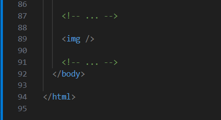
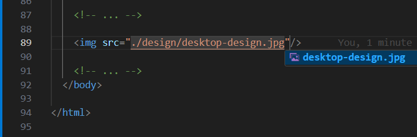
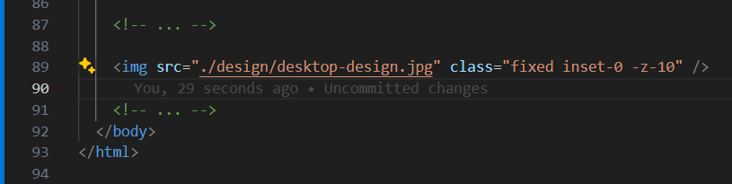
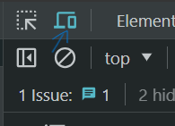
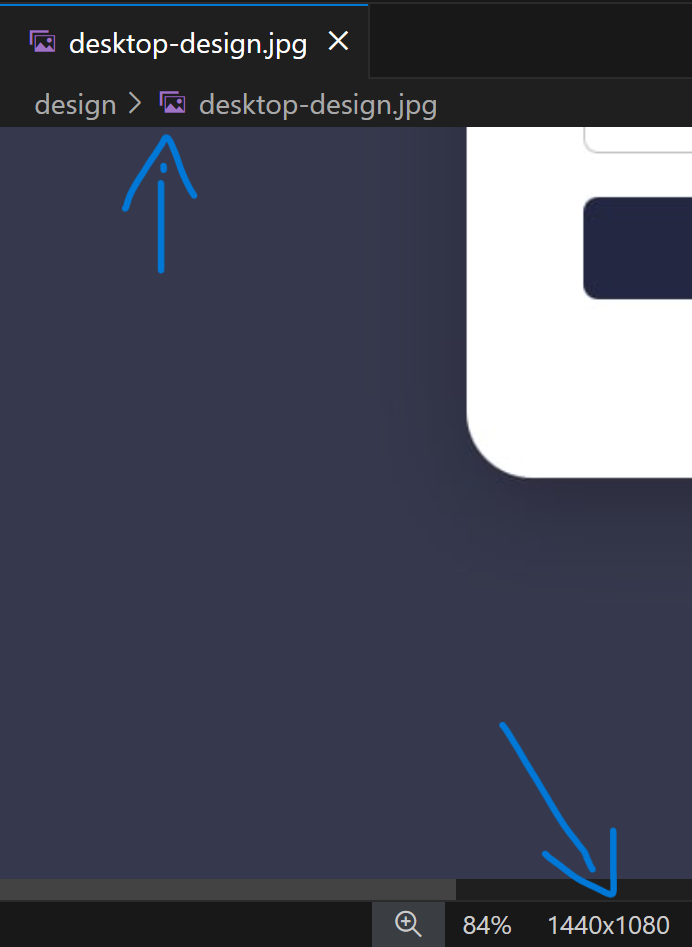
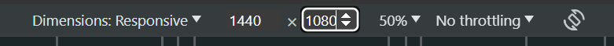
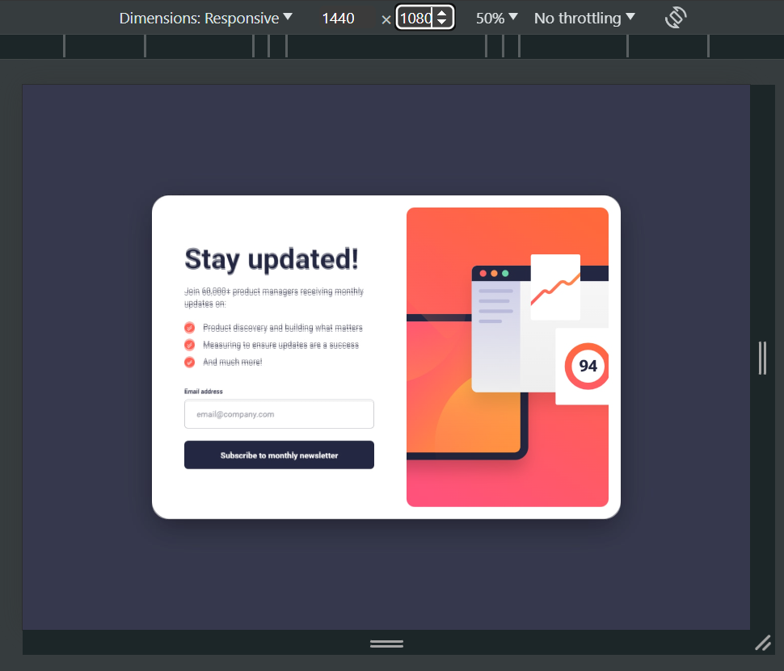

To ensure 100% fidelity to the original design while working on Frontend Mentor challenges, I follow these steps:

1. Place an `` element anywhere within the `<body>` tag of the HTML file.



2. Set the `src` attribute of the `` tag to either of the two design images:

   - `design/desktop-design`
   - `design/mobile-design`



3. Utilize [Tailwind CSS](https://tailwindcss.com/) to apply some of the following styles:

   - `fixed inset-0 -z-10` (positioning the image behind all elements without opacity)
   - `fixed inset-0 opacity-30` (causing the image to overlay the entire layout with reduced opacity)

   Alternatively, using pure CSS:

   ```css
   img {
     position: fixed;
     inset: 0;
     opacity: 0.3; /* adjust opacity as desired */
     /* or */
     z-index: -10;
   }
   ```

   With these styles, the image (the `` element) is fixed in position and covers the entire viewport.



4. Next, open the browser's developer tools (e.g., in Google Chrome, press F12) and enable Responsive Design Mode (in Google Chrome, press Ctrl+Shift+M, ensure DevTools is active).





5. In the dimensions settings, enable responsiveness (the first option) and set the dimensions (width and height) to match those of the design image.



6. Finally, the design will appear either in the foreground with reduced opacity (`fixed inset-0 opacity-30`) or in the background (`fixed inset-0 -z-10`), allowing for accurate comparison and adherence to the original design.


